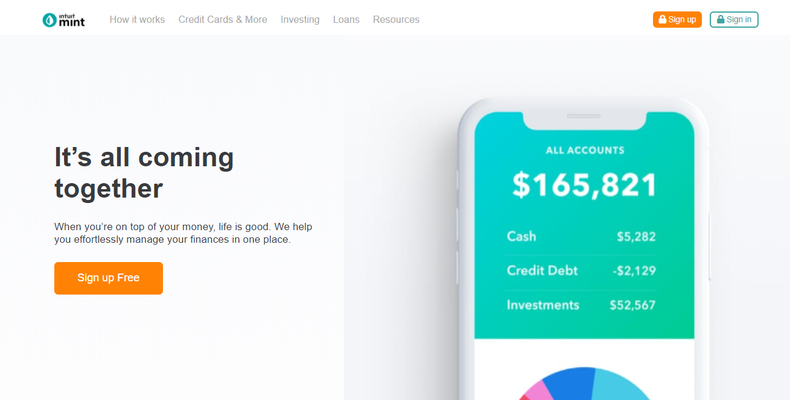
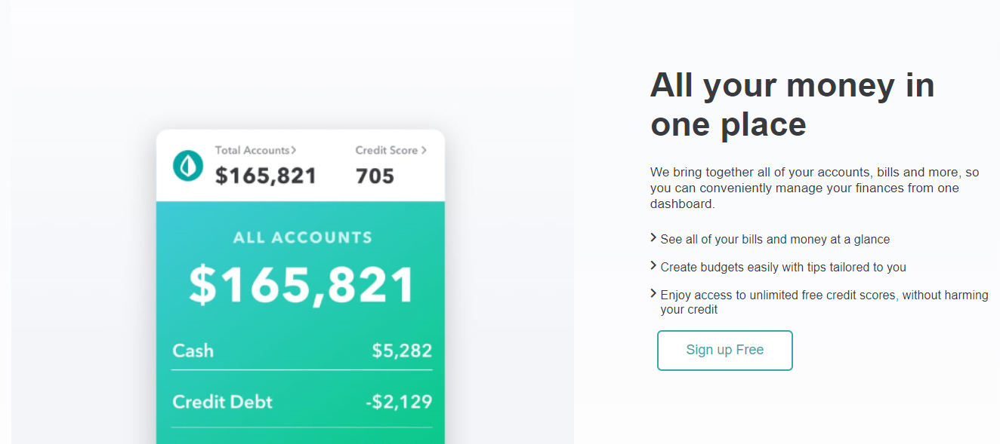
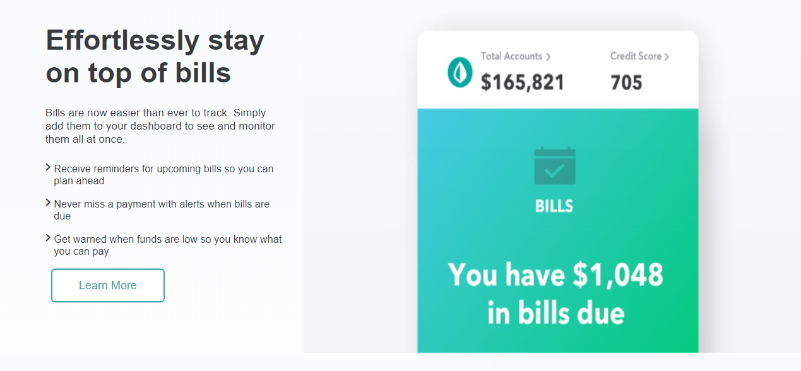
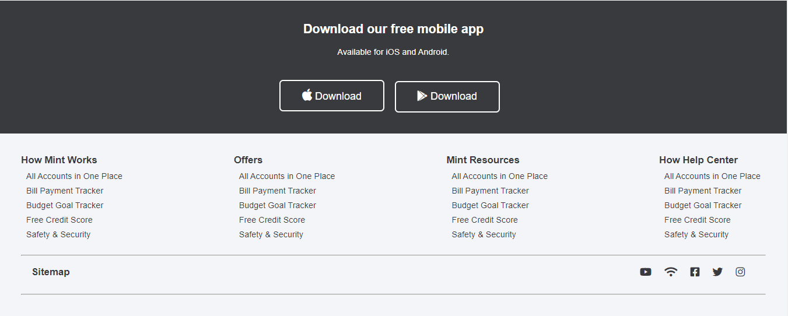

# Mint Clone

> This is a clone of mint official webpage

## Landing page

## First section

## Second section

## Footer

Additional description about the project and its features.

## Built With

- HTML
- CSS
- Font Awesome Icons

## Authors

👤 **Ntwali Heritier**

- Github: [@githubhandle](https://github.com/NtwaliHeritier)
- Twitter: [@twitterhandle](https://twitter.com/NtwaliHeritier)
- Linkedin: [linkedin](https://linkedin.com/in/ntwali-heritier-9950001a2)

## Live Link

https://raw.githack.com/NtwaliHeritier/mint-clone/features/index.html

## Show your support

Give a ⭐️ if you like this project!

## Acknowledgments

- Hat tip to anyone whose code was used
- Inspiration
- etc

## 📝 License

This project is [MIT](lic.url) licensed.